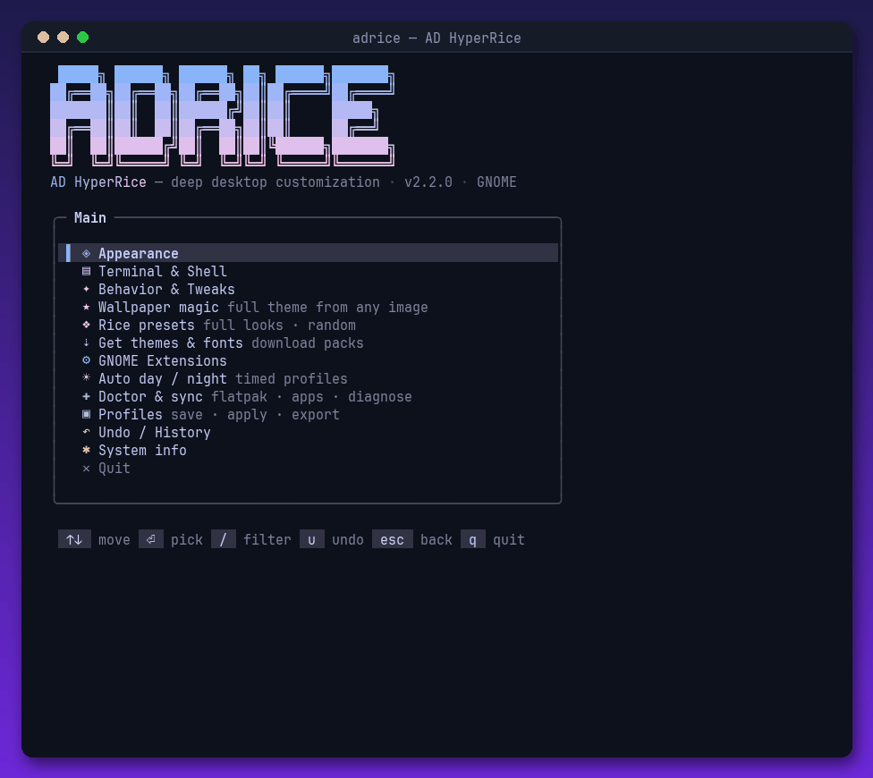

<div align="center">

# 🍚 adrice — AD HyperRice

**Rice your entire Linux desktop from one TUI.** Single file, zero hard dependencies, live previews, one-key fixes, undo for everything.

[](https://github.com/zCrxticxl/adrice/stargazers)
[](LICENSE)
[](adrice.sh)




<sup>Real recording — main menu, rice presets with live color bars, doctor & sync</sup>

</div>

---

## ✨ What it does

### ★ Wallpaper magic
Pick any image — adrice extracts its dominant colors and generates a **complete, coherent theme**: a full 16-color terminal scheme (hue-matched, readability-corrected), matching GNOME accent color, dark mode and Hyprland border color. Preview as a rendered terminal mockup before applying.

```bash
./adrice.sh magic wallpaper.jpg    # also works headless
```

### 👁️ Live preview everywhere
The highlighted theme, icon set, cursor, font or wallpaper is applied **instantly while you scroll**. `⏎` keeps it, `esc` reverts to exactly what you had. Wallpapers render inline in the terminal (chafa), GTK themes show their real `gtk.css` colors.

### 🩺 Doctor with one-key fixes
`adrice doctor` diagnoses why theming isn't working — missing tools, no nerd font, flatpak apps ignoring themes, libadwaita quirks. **Every ⚠ line is selectable and `⏎` runs the fix.**

### 🎨 And the rest

- **Rice presets** — Catppuccin, Nordic, Gruvbox, Tokyonight as complete one-shot looks + random rice roll
- **Terminal schemes** — written to **all installed terminals at once**: alacritty, kitty, foot, gnome-terminal, konsole
- **App sync** — push the active scheme into btop, cava, VS Code terminal & Spicetify
- **Flatpak theme sync** — one fix for "my theme doesn't apply to flatpak apps"
- **Auto day/night** — systemd user timers switch profiles at your times
- **Get themes & fonts** — curated downloads: Nordic, Orchis, Papirus, Tela, Bibata, Nerd Fonts…
- **Undo everything** — every change logged, `u` undoes, history rolls back to any point; pre-adrice state auto-saved as `_original`
- **Profiles + sharing** — export full looks as tar (incl. themes + wallpaper), import from file **or URL**

## 🚀 Install

```bash
git clone https://github.com/zCrxticxl/adrice.git
cd adrice && chmod +x adrice.sh
./adrice.sh
```

Requirements: `bash` ≥ 4 + truecolor terminal. Everything else is optional — **the built-in doctor installs it for you**.

## ⌨️ CLI

```
./adrice.sh               interactive TUI
./adrice.sh magic IMAGE   generate + apply a full theme from any image
./adrice.sh doctor        diagnose theming problems
./adrice.sh save NAME     snapshot current look as profile
./adrice.sh apply NAME    apply profile non-interactively
./adrice.sh undo          undo last change
./adrice.sh export NAME   pack profile + themes + wallpaper as tar
./adrice.sh import X      import such a tar — local file or URL
```

| Key | Action |
|-----|--------|
| `↑↓` / `jk` | move |
| `⏎` | select / keep previewed / run fix |
| `esc` | back / revert live preview |
| `/` | type-to-filter any list |
| `u` | undo last change |
| `q` | quit |

## 🔄 Reset

```bash
./adrice.sh apply _original    # your pre-adrice state, auto-saved on first run
```

## 📄 License

MIT — see [LICENSE](LICENSE).

---

<div align="center">
<sub>⭐ if your desktop looks better now — by <a href="https://github.com/zCrxticxl">Adrian (zCrxticxl)</a> · also: <a href="https://github.com/zCrxticxl/adhyper-linux">adhyper-linux</a> · <a href="https://github.com/zCrxticxl/ad-hyperoptimize">ad-hyperoptimize</a></sub>
</div>
